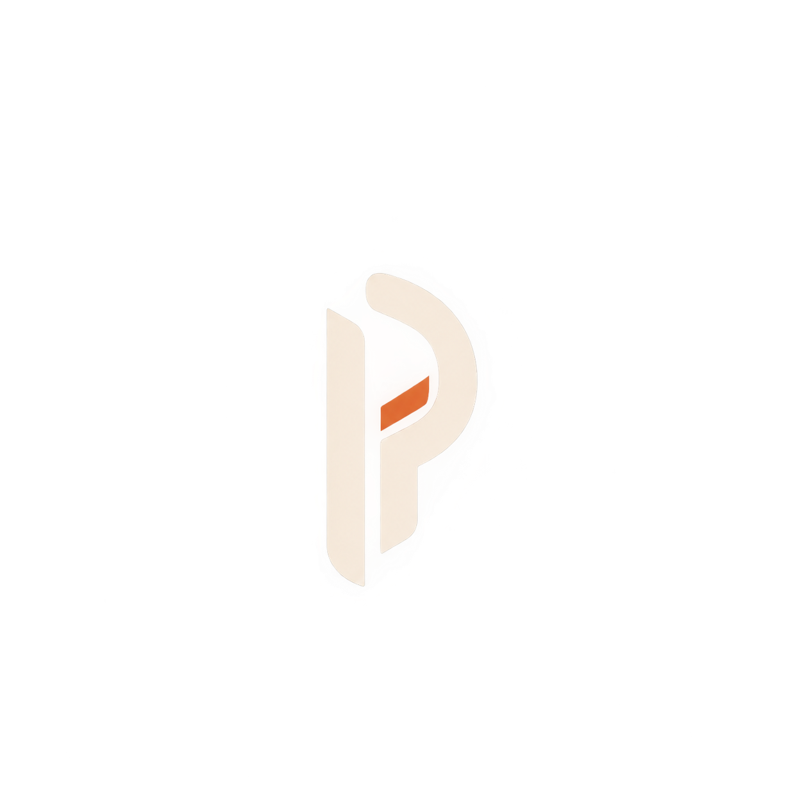
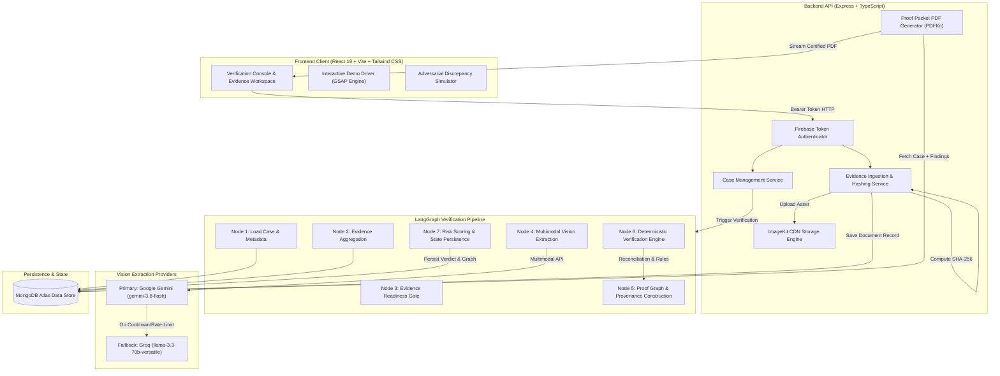
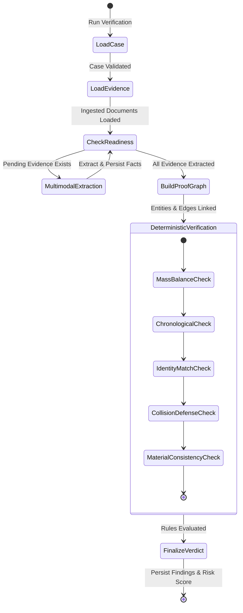

# Proofline

<div align="center">
  
  <h3>Autonomous Multi-Document Verification & Inconsistency Detection System</h3>
  <p><strong>Deterministic Truth in Circular Economy Supply Chains, Recycling Compliance, and Industrial Mass-Balance Accounting.</strong></p>

  <p>
    <a href="#core-principles">Core Principles</a> •
    <a href="#system-architecture">Architecture</a> •
    <a href="#visual-walkthrough">Visual Walkthrough</a> •
    <a href="#the-verification-engine">Verification Engine</a> •
    <a href="#adversarial-discrepancy-simulation">Simulation Engine</a> •
    <a href="#getting-started">Getting Started</a>
  </p>
</div>

---

## Executive Overview & Purpose

Global circular economies and recycling compliance systems suffer from systemic verification failure. Organizations claim compliance, recycled content percentages, and EPR (Extended Producer Responsibility) fulfillment based on fragmented, static declarations:

* **Mass-balance inflation**: Fraudulent recyclers report higher recycling output than physically entered the weighbridge scales.
* **Invoice-to-Scale Desynchronization**: Commercial invoices state high-value batches while physical weighbridge slips reflect staggered, lower-weight hauls or different materials entirely.
* **Chronological Inconsistencies**: Final settlement documentation and invoices dated prior to the physical scale weigh-ins.
* **Opaque AI Hallucinations**: Standard LLMs summarize documents with convincing fluency, but fabricate reconciliation numbers and fail basic arithmetic proofs.

**Proofline eliminates probabilistic guesswork.** It pairs high-throughput multimodal AI vision for fact extraction with a strictly deterministic, cryptographic verification pipeline. Every weighbridge slip, invoice, certificate, and scale photo is cross-checked through mathematical mass-balance algorithms, temporal causality graphs, and cross-party collision tests.

---

## Core Principles

```
  Multimodal Evidence                Deterministic Graph               Cryptographic Packet
 ┌──────────────────────┐           ┌──────────────────────┐          ┌──────────────────────┐
 │ • Invoices           │  Extract  │ • Mass-Balance Sum   │ Validate │ • SHA-256 Hashes     │
 │ • Weighbridge Slips  │ ────────> │ • Tolerance Engine   │ ───────> │ • Tamper-Proof Audit │
 │ • Weight Indicators  │           │ • Temporal Causality │          │ • Human Disposition  │
 │ • COA Declarations   │           │ • Identity Matching  │          │ • PDF Proof Packet   │
 └──────────────────────┘           └──────────────────────┘          └──────────────────────┘
```

1. **Deterministic Verification Over Generative Guesswork**  
   Language models are restricted solely to fact extraction and visual grounding. Zero mathematical reconciliation or compliance decisions are delegated to probabilistic LLM inference. All calculations ($184.60 + 184.50 + 186.50 = 555.60\text{ kg}$) are executed in deterministic code.

2. **Multi-Document Mass-Balance Reconciliation**  
   Single documents rarely tell the whole story. Proofline aggregates fragmented physical events (e.g., three separate weighbridge receipts) and compares the measured aggregate ($555.60\text{ kg}$) against the commercial invoice baseline ($560.00\text{ kg}$) to calculate exact variance ($0.79\%$) against tolerance thresholds.

3. **Temporal Causality & Chronological Consistency**  
   Physical reality enforces strict temporal ordering: tare weigh-in $\le$ gross weigh-out $\le$ laboratory inspection $\le$ commercial invoice generation. Proofline models evidence timestamps in a directed timeline and flags retroactive documentation.

4. **Cryptographic Provenance & Collision Defense**  
   Every uploaded asset receives an immutable SHA-256 digest at ingestion. If an identical document is reused across different case transactions, the cross-case collision detector triggers an immediate double-counting alert.

5. **Human-in-the-Loop Institutional Governance**  
   Automated verification calculates risk and highlights evidence discrepancies, but does not unilaterally overrule compliance officers. Reviewers record signed, timestamped dispositions (`APPROVED`, `REJECTED`, `CLARIFICATION_REQUESTED`) permanently sealed into the audit trail.

---

## System Architecture

Proofline uses a decoupled, event-driven architecture featuring a high-performance React client, an Express/TypeScript verification backend, LangGraph stateful workflow orchestration, and resilient multi-model vision extraction.

### High-Level System Architecture



---

## The Verification Engine

### LangGraph Workflow & State Transitions

The verification pipeline is structured as an immutable directed acyclic graph (DAG) managed by LangGraph. Each node receives the current verification state, executes an isolated step, and returns state patches:



### Verification Rules & Reconciliation Matrix

| Rule Name | Target Scope | Deterministic Logic | Failure Condition |
| :--- | :--- | :--- | :--- |
| **`MASS_BALANCE_TOLERANCE`** | Cumulative Scale Weights vs. Invoice | $|\sum W_{\text{scale}} - W_{\text{claimed}}| / W_{\text{claimed}} \le \text{Threshold}$ | Variance $> 2.0\%$ (configurable) |
| **`CHRONOLOGICAL_SEQUENCE`** | Evidence Timestamps | $T_{\text{tare}} \le T_{\text{gross}} \le T_{\text{analysis}} \le T_{\text{invoice}}$ | Weighbridge timestamp occurs after Invoice date |
| **`TRANSACTION_IDENTITY`** | Document Headers & Identifiers | Document Transaction ID matches Case Baseline | Header cites foreign ID (e.g., `EW-999` vs `EW-104`) |
| **`CROSS_CASE_COLLISION`** | SHA-256 Content Digest | Match SHA-256 hash across global database index | Hash matches another active transaction (Double-counting) |
| **`MATERIAL_CLASSIFICATION`** | Declared Product Types | Strict canonical material compatibility | Incompatible grades (e.g., `PET Flakes` vs `HDPE`) |

---

## Visual Walkthrough

### 1. Operations Console (`/cases`)
The central dashboard provides real-time oversight over all physical claims, risk distributions, and verification statuses. Compliance officers can launch single-click autonomous interactive demos, create new claims, inspect cases, and export audit packets.

<div align="center">
  
</div>

---

### 2. Case Intake (`/cases/new`)
Case initialization sets the commercial baseline against which all physical evidence will be independently reconciled: Transaction ID, Counterparty, Declared Material, Claimed Net Weight, and Issuing Organization.

<div align="center">
  
</div>

---

### 3. Evidence Workspace (`/cases/:id`)
Compliance teams upload multimodal physical evidence. Each document is thumbnailed, hashed with SHA-256, mapped to its document archetype (Commercial Invoice, Weighbridge Scale Slips, Certificates of Analysis), and tracked through extraction readiness.

<div align="center">
  
</div>

---

### 4. Verified Audit Report (`/cases/:id/verification`)
Upon running the verification pipeline, Proofline renders the comprehensive audit artifact:
* **Composite Risk Score**: Visual badge (`LOW`, `MEDIUM`, `HIGH`) and risk meter.
* **Mass-Balance Accounting**: Side-by-side reconciliation of Claimed Weight ($560.00\text{ kg}$) vs. Measured Aggregate ($555.60\text{ kg}$) with exact percentage variance ($0.79\%$).
* **Evidence Chain Provenance**: Interactive inspection drawer linking extracted facts back to exact document source files.
* **Human Review & Resolution**: Institutional workflow allowing officers to record formal determinations (`Approve`, `Reject`, `Request Clarification`) with mandatory rationale.

<div align="center">
  
</div>

---

### 5. Adversarial Discrepancy Simulator
Built directly into the verification workspace, the simulator allows auditors to stress-test Proofline's defenses by injecting real-world industrial anomalies:

<div align="center">
  
</div>

* **Timeline Anomaly**: Injects weighbridge tickets dated 5 days after final commercial invoice settlement.
* **Tolerance Discrepancy**: Skews scale measurements to exceed tolerance limits ($+14\%$ variance).
* **Quantity Conflict**: Simulates invoices claiming $620\text{ kg}$ against $555.6\text{ kg}$ measured.
* **Identity Discrepancy**: Injects document headers referencing mismatched transactions (`EW-999`).
* **Material Conflict**: Injects conflicting polymer grade classifications (`PET` vs `HDPE`).

---

## Mass-Balance Mathematical Model

Proofline enforces conservative arithmetic checks across fragmented scale tickets:

$$\Delta W = \left| \sum_{i=1}^{n} w_i - W_{\text{claimed}} \right|$$

$$\text{Variance (\%)} = \left( \frac{\Delta W}{W_{\text{claimed}}} \right) \times 100$$

In the canonical **EW-104** industrial scenario:
* **Claimed Invoice Quantity**: $560.00\text{ kg}$
* **Weighbridge Ticket 1**: $184.60\text{ kg}$
* **Weighbridge Ticket 2**: $184.50\text{ kg}$
* **Weighbridge Ticket 3**: $186.50\text{ kg}$
* **Total Measured Weight**: $184.60 + 184.50 + 186.50 = 555.60\text{ kg}$
* **Variance**: $\frac{|555.60 - 560.00|}{560.00} \times 100 = 0.79\%$

Since $0.79\% \le 2.0\%$ (the default tolerance boundary), the case resolves to **VERIFIED — LOW RISK**.

---

## Technology Stack

| Layer | Technologies & Frameworks |
| :--- | :--- |
| **Frontend** | React 19, TypeScript, Vite, Tailwind CSS v4, Lucide Icons, GSAP Animation Engine |
| **Backend API** | Node.js, Express, TypeScript, Zod Schema Validation, PDFKit |
| **AI Orchestration** | LangGraph, Google GenAI SDK (`gemini-3.8-flash`), Groq SDK (`llama-3.3-70b-versatile`) |
| **Primary Database** | MongoDB Atlas, Mongoose ODM |
| **Object & Media Storage** | ImageKit.io with CDN Delivery |
| **Security & Auth** | Firebase Admin SDK, SHA-256 Content Fingerprinting, Environment Key Pools |

---

## Getting Started

### Prerequisites
* **Node.js**: `v20.x` or `v22.x`
* **npm**: `v10.x` or higher
* **MongoDB Atlas** or local MongoDB instance
* **Gemini API Key** (Google AI Studio)

### 1. Repository Setup

```bash
git clone https://github.com/achyutpandey1212-source/ProofLine.git
cd ProofLine
```

### 2. Environment Configuration

Copy `.env.example` to `backend/.env`:

```bash
cp .env.example backend/.env
```

Configure your secrets in `backend/.env`:

```env
PORT=5000
MONGODB_URI=mongodb+srv://<user>:<password>@cluster.mongodb.net/proofline?retryWrites=true&w=majority
FRONTEND_URL=http://localhost:5173

# AI Vision Providers
GEMINI_API_KEY=your_gemini_api_key_here
GEMINI_MODEL=gemini-3.8-flash
GROQ_API_KEY=your_groq_api_key_here
GROQ_MODEL=llama-3.3-70b-versatile

# ImageKit CDN Storage
IMAGEKIT_PUBLIC_KEY=your_imagekit_public_key
IMAGEKIT_PRIVATE_KEY=your_imagekit_private_key
IMAGEKIT_URL_ENDPOINT=https://ik.imagekit.io/your_endpoint

# Firebase Authentication (Optional in Local Dev Mode)
FIREBASE_PROJECT_ID=your_firebase_project_id
FIREBASE_CLIENT_EMAIL=your_firebase_client_email
FIREBASE_PRIVATE_KEY="your_firebase_private_key"
```

### 3. Backend Installation & Startup

```bash
cd backend
npm install
npm run build
npm run dev
```

Verify backend health:
```bash
curl http://localhost:5000/health
# {"status":"ok"}
```

### 4. Frontend Installation & Startup

Open a second terminal:

```bash
cd frontend
npm install
npm run dev
```

Navigate to `http://localhost:5173` in your browser.

---

## Running the Interactive Autonomous Demo

To experience Proofline's real-time demonstration:

1. Open `http://localhost:5173/cases` in your browser.
2. Click **`▶ Run Interactive Demo`** in the top action bar.
3. Proofline's demo driver will take control of the application:
   * Visibly navigates to `/cases/new` and humanistically types the `EW-104` transaction baseline.
   * Transition to the Evidence Workspace and sequentially ingests the 5 industrial demo documents.
   * Triggers the real multimodal verification workflow.
   * Displays the comprehensive Verification Audit Report with full mass-balance reconciliation.

---

## Security, Privacy & Integrity

* **Zero Hardcoded Secrets**: Strictly enforced environment-based credential management.
* **Cryptographic Immutability**: Evidence records cannot be silently swapped; SHA-256 hashes lock document identity.
* **Segregated Roles**: System verification verdict is logically separated from human business disposition.

---

<div align="center">
  <sub>Built for industrial transparency, circular economy integrity, and deterministic compliance verification.</sub>
</div>
